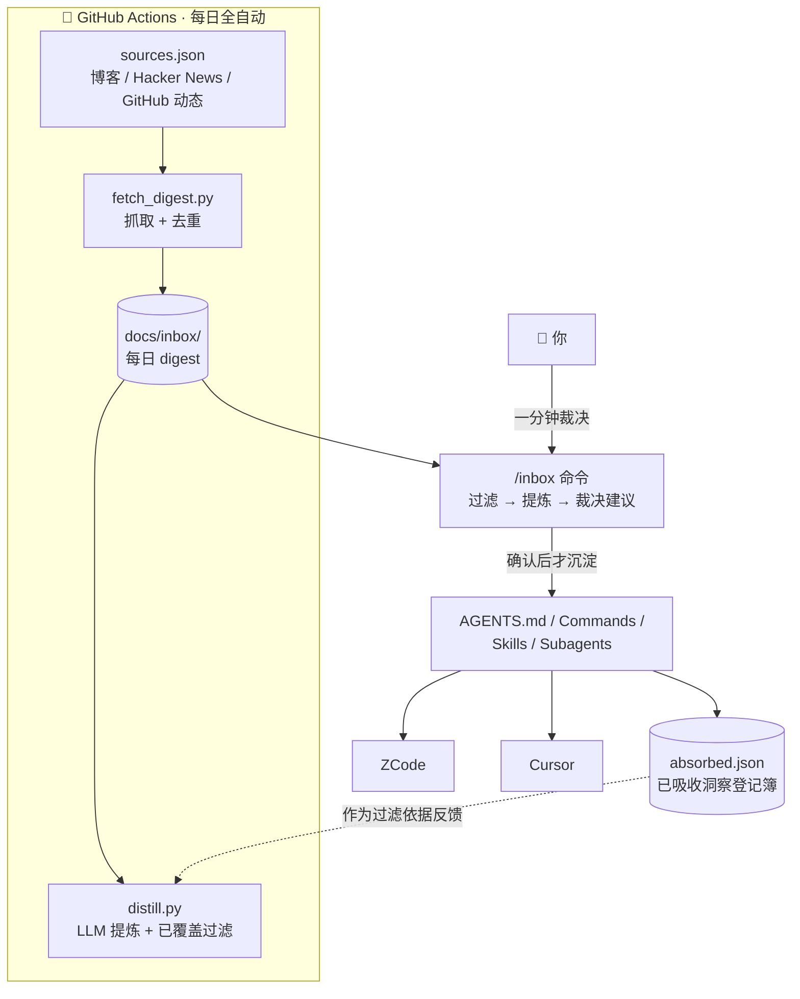

# Agent OS · ZCode × Cursor

> **一套低 Token、可维护、可迁移的个人 Agent 工作系统——让别人的思想自动为你工作。**
> Personal Agent OS: minimal always-on rules, layered on-demand context, and an automated idea-intake pipeline.

灵感来自 [Andrej Karpathy](https://karpathy.bearblog.dev/) 关于个人 Agent 工作流的分享。核心理念只有一句话：

> **不是让 Agent 写更多，而是让 Agent 选择更好的完成方式。**

```
Understand → Choose Medium → Plan → Execute → Verify → Deliver
```

## 它由什么组成

| 层 | 载体 | 加载时机 | 职责 |
|---|---|---|---|
| 核心规则 | `AGENTS.md`（10 行） | 每次会话常驻 | 工作原则：先理解再行动、最小修改、执行后验证 |
| Commands | 7 个短指令 | 用户 `/xxx` 显式触发 | 高频动作流程模板：plan / research / debug / review / verify / html / inbox |
| Skills | 4 个方法论 | 按任务匹配自动加载 | deep-research / architecture / industrial-ai / html-artifact |
| Subagents | 3 个角色 | 主 Agent 调度 | researcher（只读研究）/ reviewer（只读审查）/ architect（只设计不改码） |
| 灵感管道 | GitHub Actions | 每日定时全自动 | 抓取大佬动态 → LLM 提炼 + 已接入内容过滤 → 人工裁决沉淀 |

设计约束：**复杂内容一律下沉，不进 AGENTS.md**——每条常驻规则的持续成本是之后每次会话都为它付 Token。

## 灵感管道：让大佬的思想自动流进你的系统

这是本项目最有趣的部分。每天定时（北京时间 09:30）自动运行：



三条铁律（详见 [ADR-0002](docs/decisions/0002-auto-thought-intake.md)、[ADR-0003](docs/decisions/0003-content-level-filtering.md)）：

1. **自动管道永不直接修改规则文件**——沉淀必须经人工确认，这是防膨胀的闸门。
2. **过滤依据动态生成**——每次运行时从当前 AGENTS.md / 命令 / 技能 / 子代理 / 已吸收洞察实时构建"系统现状清单"；你新增任何技能，过滤自动跟上，零维护。
3. **过滤对想法不对链接**——同一想法换了出处（新文章/访谈/转述）照样被识别；被过滤条目归入"已覆盖"节透明可见，不静默丢弃。

## 快速开始

### 1. 部署规则到你的 Agent 工具

```bash
git clone https://github.com/Roarpeng/agent-os.git
cd agent-os
bash sync.sh --dry   # 预览将部署什么
bash sync.sh         # 部署到 ~/.zcode/ 与 ~/.cursor/
```

重启 ZCode / Cursor 生效：输入 `/` 应看到 plan、research、debug、review、verify、html、inbox 命令。被覆盖的旧文件自动备份到 `~/.agent-os-backup/<时间戳>/`。

| 仓库 | ZCode | Cursor |
|---|---|---|
| `AGENTS.md` | `~/.zcode/AGENTS.md` | `~/.cursor/rules/agent-os.mdc`（脚本自动生成） |
| `commands/*.md` | `~/.zcode/commands/` | `~/.cursor/commands/` |
| `skills/*/` | `~/.zcode/skills/` | `~/.cursor/skills/` |
| `agents/*.md` | `~/.zcode/agents/` | `~/.cursor/agents/` |

换 Codex、Claude Code 等其他 Agent？核心方法论只维护一份，扩展 `sync.sh` 的映射即可，不用重写系统。

### 2. 启用每日灵感管道（可选但推荐）

Fork 或推到你自己的 GitHub 仓库后：

1. 编辑 `pipeline/sources.json`——声明你想追随的人（rss 博客 / hn 关键词 / github 用户三类，增删自由）。
2. 仓库 **Settings → Secrets and variables → Actions** 添加 `LLM_API_KEY`（可选，启用自动提炼）：
   - 智谱 GLM：`LLM_BASE_URL=https://open.bigmodel.cn/api/anthropic`（或 `/api/paas/v4`）、`LLM_MODEL=glm-5.3-flash`
   - OpenAI 兼容接口：只配 `LLM_API_KEY` 即可（默认 `gpt-4o-mini`）
3. `gh workflow run digest` 手动触发一次验证，之后每天 09:30（北京时间）自动运行。

不配密钥也能用：管道照常抓取生成原始 digest，过滤与提炼由 `/inbox` 用你本地的会话模型完成。

### 3. 日常使用

```bash
git pull                                  # 早上拉取自动 digest
# 在 ZCode / Cursor 中：
/inbox                                    # 一分钟裁决候选洞察
```

`/inbox` 的裁决结果会：写入对应规则文件 → 登记 `absorbed.json`（下次自动过滤的依据）→ 更新 changelog → `bash sync.sh` 部署 → commit + push，全程闭环。

## 仓库结构

```
agent-os/
├── AGENTS.md          # 核心规则（唯一常驻全局上下文）
├── commands/          # 7 个高频动作
├── skills/            # 4 个专业方法论
├── agents/            # 3 个子代理
├── pipeline/          # 灵感管道：sources.json / fetch / distill / absorbed
├── docs/
│   ├── inbox/         # 每日自动 digest（管道产出）
│   ├── design.md      # 设计文档
│   ├── blueprint.html # 原始设计蓝图
│   ├── changelog.md   # 变更记录
│   └── decisions/     # 架构决策记录（ADR）
└── sync.sh            # 部署脚本
```

## Definition of Done

Agent 结束任何任务前的最小检查：理解目标 / 选对输出媒介 / 无关修改为零 / 必要验证完成 / 关键约束保留 / 结果可执行。

## 已知注意点

- Windows 下 symlink 不可靠，所以用 sync 复制分发；Linux/macOS 的 bash 同样可跑。
- ZCode 中命令名若与内置命令重名会被 `/` 菜单过滤（重命名文件即可）；若你的 ZCode 版本不识别 `~/.zcode/agents/`，在 Settings → Subagents 手动导入。
- 定时任务在仓库 **60 天无活动**后会被 GitHub 自动暂停（防止Actions被遗忘空跑），长期使用记得偶尔 push。

## License

[MIT](LICENSE)
