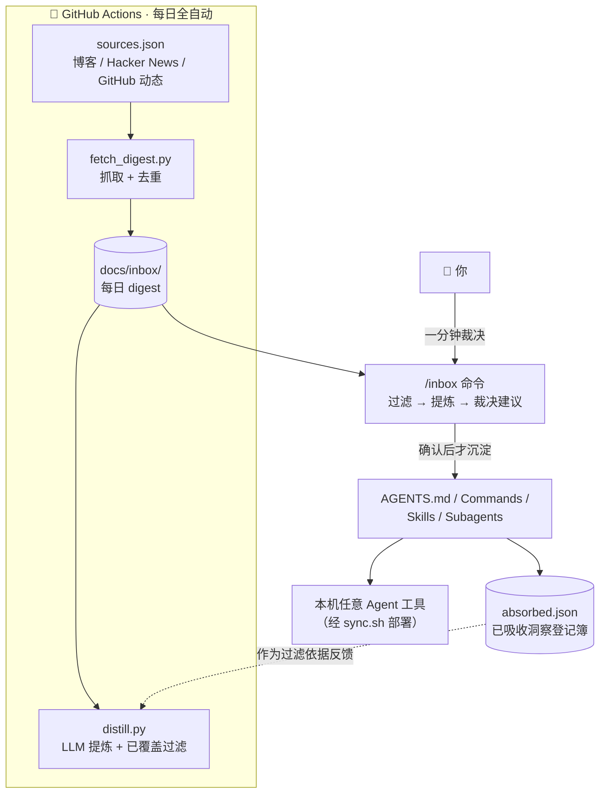

# Agent OS

> **一套低 Token、可维护、可迁移的个人 Agent 工作系统——让别人的思想自动为你工作。**
> Personal Agent OS: minimal always-on rules, layered on-demand context, and an automated idea-intake pipeline.
> Works with any agent tool: ZCode / Cursor / Claude Code / Codex / Gemini CLI / opencode / …

灵感来自 [Andrej Karpathy](https://karpathy.bearblog.dev/) 关于个人 Agent 工作流的分享。核心理念只有一句话：

> **不是让 Agent 写更多，而是让 Agent 选择更好的完成方式。**

```
Understand → Choose Medium → Plan → Execute → Verify → Deliver
```

## 它由什么组成

| 层 | 载体 | 加载时机 | 职责 |
|---|---|---|---|
| 核心规则 | `AGENTS.md`（10 行） | 每次会话常驻 | 工作原则：先理解再行动、最小修改、执行后验证 |
| Commands | 7 个短指令 | 用户 `/xxx` 显式触发 | 高频动作流程模板：plan / research / debug / review / verify / html / inbox |
| Skills | 4 个方法论 | 按任务匹配自动加载 | deep-research / architecture / industrial-ai / html-artifact |
| Subagents | 3 个角色 | 主 Agent 调度 | researcher（只读研究）/ reviewer（只读审查）/ architect（只设计不改码） |
| 灵感管道 | GitHub Actions | 每日定时全自动 | 抓取大佬动态 → LLM 提炼 + 已接入内容过滤 → 人工裁决沉淀 |

设计约束：**复杂内容一律下沉，不进 AGENTS.md**——每条常驻规则的持续成本是之后每次会话都为它付 Token。内容层全部是通用 Markdown（`AGENTS.md` / 命令 / `SKILL.md` / 子代理提示词），不依赖任何特制工具或私有格式，所以任何 Agent 工具都能用。

## 灵感管道：让大佬的思想自动流进你的系统

这是本项目最有趣的部分。每天定时（北京时间 09:30）自动运行：



三条铁律（详见 [ADR-0002](docs/decisions/0002-auto-thought-intake.md)、[ADR-0003](docs/decisions/0003-content-level-filtering.md)）：

1. **自动管道永不直接修改规则文件**——沉淀必须经人工确认，这是防膨胀的闸门。
2. **过滤依据动态生成**——每次运行时从当前 AGENTS.md / 命令 / 技能 / 子代理 / 已吸收洞察实时构建"系统现状清单"；你新增任何技能，过滤自动跟上，零维护。
3. **过滤对想法不对链接**——同一想法换了出处（新文章/访谈/转述）照样被识别；被过滤条目归入"已覆盖"节透明可见，不静默丢弃。

## 快速开始

### 1. 安装

**方式 A · 一句话交给 Agent（推荐）**——在你的 Agent 工具里原样粘贴：

```text
安装 Agent OS 到这台机器：git clone https://github.com/Roarpeng/agent-os.git ~/agent-os，阅读 ~/agent-os/README.md 与 sync.sh 了解部署方式，先运行 bash ~/agent-os/sync.sh --dry 预览，确认无误后运行 bash ~/agent-os/sync.sh 把规则、命令、技能、子代理部署到本机检测到的所有 Agent 工具；若我的工具未被识别，按 README 的部署映射表手工部署；完成后报告部署清单、需要重启的工具和验证方法。
```

**方式 B · 手动安装**：

```bash
git clone https://github.com/Roarpeng/agent-os.git ~/agent-os
cd ~/agent-os
bash sync.sh --dry   # 预览将部署什么
bash sync.sh         # 部署到本机已安装的 Agent 工具
```

辅助命令：`bash sync.sh --list` 查看支持的工具与部署路径；`bash sync.sh --target claude,codex` 只部署指定工具；`bash sync.sh --all` 部署到全部已知工具。默认只部署本机检测到已安装的工具。

#### 部署映射

| 工具 | 全局规则 | Commands | Skills | Subagents |
|---|---|---|---|---|
| ZCode | `~/.zcode/AGENTS.md` | `~/.zcode/commands/` | `~/.zcode/skills/` | `~/.zcode/agents/` |
| Claude Code | `~/.claude/CLAUDE.md` | `~/.claude/commands/` | `~/.claude/skills/` | `~/.claude/agents/` |
| Cursor | `~/.cursor/rules/agent-os.mdc`（脚本生成） | `~/.cursor/commands/` | `~/.cursor/skills/` | `~/.cursor/agents/` |
| Codex | `~/.codex/AGENTS.md` | `~/.codex/prompts/`（自定义提示词） | — | — |
| Gemini CLI | `~/.gemini/GEMINI.md` | —（其命令为 TOML 格式） | — | — |
| opencode | `~/.config/opencode/AGENTS.md` | `~/.config/opencode/commands/` | `~/.config/opencode/skills/` | `~/.config/opencode/agents/` |

- 被覆盖的旧文件自动备份到 `~/.agent-os-backup/<时间戳>/`；全局规则文件以本仓库为单一事实源。
- 重启工具生效：输入 `/` 应看到 plan、research、debug、review、verify、html、inbox 命令。

**工具不在表里？** 内容层是通用 Markdown，不绑定任何私有格式。把上面这张映射表发给你的 Agent，让它照做即可；也欢迎提 PR 在 `sync.sh` 的 `TOOL_TABLE` 加一行（一行即一个新工具）。

### 2. 启用每日灵感管道（可选但推荐）

Fork 或推到你自己的 GitHub 仓库后：

1. 编辑 `pipeline/sources.json`——声明你想追随的人（rss 博客 / hn 关键词 / github 用户三类，增删自由）。默认已内置 15 个源：Karpathy、Simon Willison、Lilian Weng、Armin Ronacher、Hamel Husain、Eugene Yan、swyx（Latent Space）、Sebastian Raschka、Chip Huyen、Nathan Lambert（Interconnects）、宝玉、Mitchell Hashimoto 的博客，HN 提及 Karpathy，karpathy 与 simonw 的 GitHub 动态——覆盖 Agent 方法论、LLM 工程、评测、研究趋势与中文实践。
2. 仓库 **Settings → Secrets and variables → Actions** 添加 `LLM_API_KEY`（可选，启用自动提炼）：
   - 智谱 GLM：`LLM_BASE_URL=https://open.bigmodel.cn/api/anthropic`（或 `/api/paas/v4`）、`LLM_MODEL=glm-5.3-flash`
   - OpenAI 兼容接口：只配 `LLM_API_KEY` 即可（默认 `gpt-4o-mini`）
3. `gh workflow run digest` 手动触发一次验证，之后每天 09:30（北京时间）自动运行。

不配密钥也能用：管道照常抓取生成原始 digest，过滤与提炼由 `/inbox` 用你本地的会话模型完成。

### 3. 日常使用

```bash
git pull                                  # 早上拉取自动 digest
# 在你的 Agent 工具中：
/inbox                                    # 一分钟裁决候选洞察
```

`/inbox` 的裁决结果会：写入对应规则文件 → 登记 `absorbed.json`（下次自动过滤的依据）→ 更新 changelog → `bash sync.sh` 部署 → commit + push，全程闭环。

## 仓库结构

```
agent-os/
├── AGENTS.md          # 核心规则（唯一常驻全局上下文）
├── commands/          # 7 个高频动作
├── skills/            # 4 个专业方法论
├── agents/            # 3 个子代理
├── pipeline/          # 灵感管道：sources.json / fetch / distill / absorbed
├── docs/
│   ├── inbox/         # 每日自动 digest（管道产出）
│   ├── design.md      # 设计文档
│   ├── blueprint.html # 原始设计蓝图
│   ├── changelog.md   # 变更记录
│   └── decisions/     # 架构决策记录（ADR）
└── sync.sh            # 多工具部署脚本
```

## Definition of Done

Agent 结束任何任务前的最小检查：理解目标 / 选对输出媒介 / 无关修改为零 / 必要验证完成 / 关键约束保留 / 结果可执行。

## 已知注意点

- Windows 下 symlink 不可靠，所以用 sync 复制分发；Linux/macOS 的 bash（含 Git Bash）同样可跑。
- 部分工具中命令名若与内置命令重名会被 `/` 菜单过滤（重命名文件即可）；个别版本不识别全局 agents 目录时，在设置里手动导入。
- Gemini CLI 仅部署全局规则——其自定义命令为 TOML 格式，与通用 Markdown 命令不通用；Codex 无全局 skills/subagents 目录，命令进 `prompts/`。
- 定时任务在仓库 **60 天无活动**后会被 GitHub 自动暂停（防止Actions被遗忘空跑），长期使用记得偶尔 push。

## License

[MIT](LICENSE)
